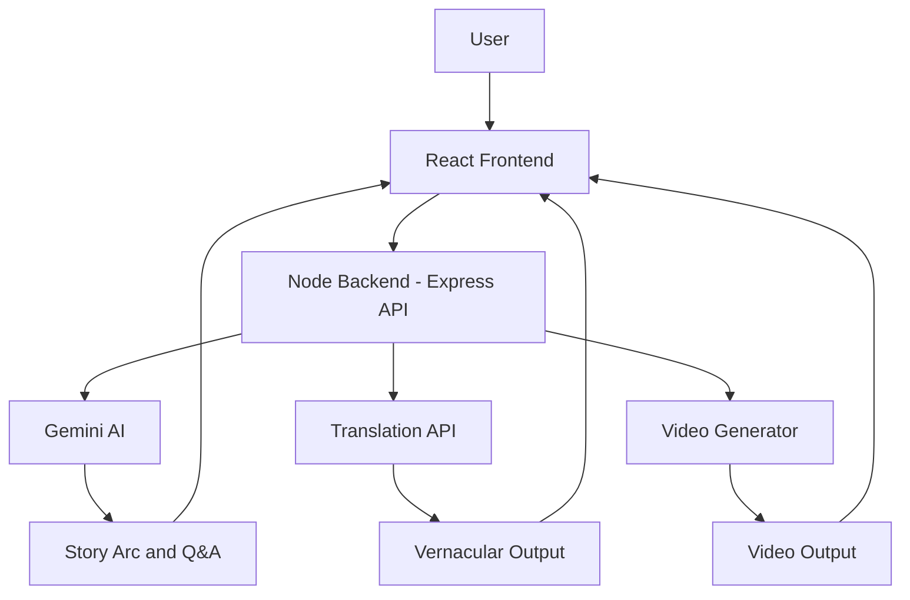
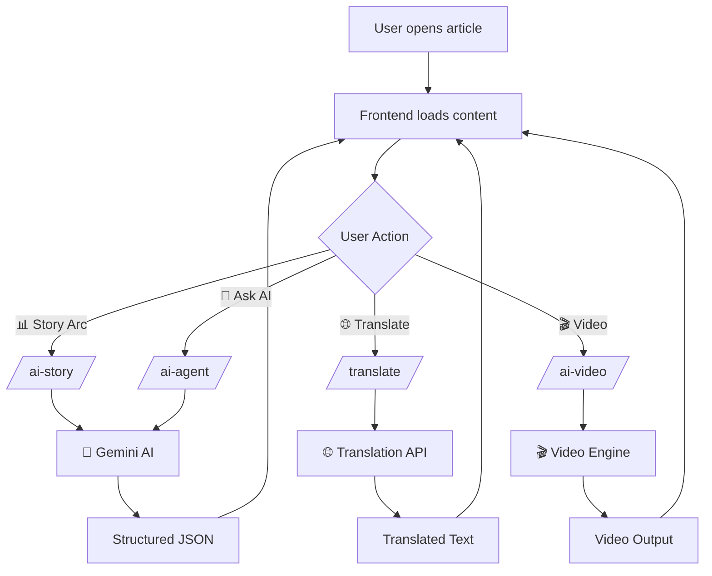
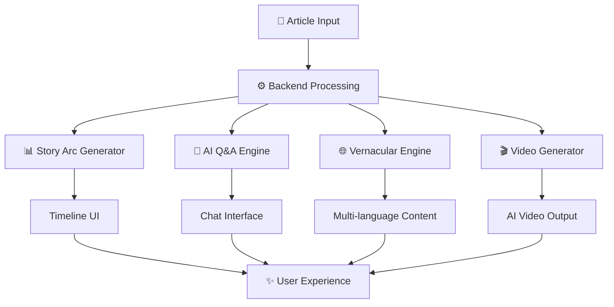

# 🧠 NEWSLY — The Intelligent News Experience

**NEWSLY** is an AI-powered platform that transforms traditional news into **interactive, personalized, and actionable intelligence**.

Instead of just reading articles, users can:

* 📊 Understand the story behind the news
* 🧠 Ask AI questions
* 🎯 Get personalized recommendations
* 🎬 Watch AI-generated news videos
* 🔮 Predict future outcomes

---

# 🌟 Core Vision

> News should not just inform — it should **explain, guide, and predict**.

---

# 💡 Key Features

## 🧭 1. Story Arc Tracker

* Converts any article into a **visual narrative**
* Includes:

  * 📅 Timeline of events
  * 📊 Sentiment flow
  * 👥 Key players
  * 🔮 Future prediction

---

## 🎬 2. AI Video Studio ✅

* Automatically converts news into **short AI-generated videos**
* Features:

  * 🎙️ AI narration (Text-to-Speech)
  * 🧾 Script generation using AI
  * 📊 Visual storytelling (slides/frames)
* Helps users **consume news faster and more engagingly**

---

## 🧠 3. AI Briefings (News Navigator)

* Combines multiple insights into a **single intelligent briefing**
* Eliminates need to read multiple articles

---

## 🤖 4. Interactive AI Q&A

* Ask:

  * “Why is this important?”
  * “Explain in simple terms”
* AI responds in **structured, easy-to-understand points**

---

## 🎯 5. Personalized News Recommendations ✅

* Tracks user reading behavior
* Recommends:

  * Similar topics
  * Related stories
  * Trending insights

👉 Example:

> “Because you read startup news → here are funding updates”

---

## 💡 6. “Why This Matters” Layer

* Every article includes:

  * Real-world impact
  * User relevance
  * Market implications

---

## ⚡ 7. Impact Indicator

* Displays:

  * 🔴 High Impact
  * 🟡 Medium
  * 🟢 Low

---

# 🚀 Unique Selling Points (USP)

### 💥 1. News → Intelligence Transformation

We don’t summarize news — we **convert it into understanding**

---

### 💥 2. Multi-Format News Experience

Users can:

* 📖 Read
* 📊 Visualize (timeline)
* 🎬 Watch (video)

---

### 💥 3. Personalized Intelligence Layer

News adapts to:

* User interests
* Reading patterns
* Context

---

### 💥 4. Predictive + Explainable AI

* 🔮 Future predictions
* 💡 “Why this matters” insights

---

# 🏗️ System Architecture

## 🖥️ Frontend

* React + Vite
* Tailwind CSS
* Framer Motion

## ⚙️ Backend

* Node.js + Express
* Google Gemini API

---

## 🔄 AI Flow

```id="flow991"
User → Select Article
     → Backend API
     → AI Processing
     → Structured Output
     → UI (Timeline / Video / Insights)
```

---

# 🎬 Video Generation Flow

```id="flowvid"
Article → AI Script Generation → Voice (TTS)
       → Slide Rendering → Video Output
```
## 🏗️ System Architecture


---

## 🔄 Data Flow



---

## 🚀 Feature Flow (Core Innovation)



---

# 🔌 Extensible AI Architecture

Supports future integration with:

* ✅ Gemini (Current)
* 🔜 Ollama (Local LLM)
* 🔜 Multi-model routing

---

# ⚙️ Setup Instructions

## 1️⃣ Clone Repo

```id="clone99"
git clone <repo-url>
cd project
```

## 2️⃣ Install Dependencies

```id="inst99"
npm install
cd backend && npm install
```

## 3️⃣ Environment Variables

```id="env99"
GEMINI_API_KEY=your_key
```

## 4️⃣ Run Project

```id="run99"
node server.js
npm run dev
```

---

# 🔗 API Endpoints

### 🧠 Story Arc

```id="api11"
POST /ai-story
```

### 🤖 AI Q&A

```id="api22"
POST /ai-agent
```

### 🎬 Video Generation

```id="api33"
POST /ai-video
```

---

# ⚠️ Challenges Solved

* Large AI responses → controlled via strict prompts
* JSON parsing errors → safe parsing + fallback
* API latency → timeout + fallback system
* UX blocking → loading states

---

# 🚀 Future Enhancements

## 🔮 Short Term

* 🔁 Regenerate story
* 🎧 Voice-only news mode
* 📊 Better visual timeline

---

## 🌍 Medium Term

* 📡 Real-time news APIs integration
* 🌐 Vernacular translation (Hindi, Tamil, Telugu)
* 🧠 Advanced recommendation engine

---

## 🚀 Long Term

* 🎬 Fully automated AI video editor
* 🧠 Knowledge graph for users
* 🔗 Story linking across articles
* ⚡ Multi-model AI routing
---


## 🎯 One-Line Summary

> “We built a system that converts news into **interactive intelligence** using AI, translation, and multimedia generation.”


# 🎯 Problem Solved

> Users don’t need more news.
> They need **clarity, context, and direction**.

---
👩‍💻 Built For

ET GenAI Hackathon 🚀

---
# 💬 Final Thought

> “We don’t just deliver news.
> We deliver understanding.”
